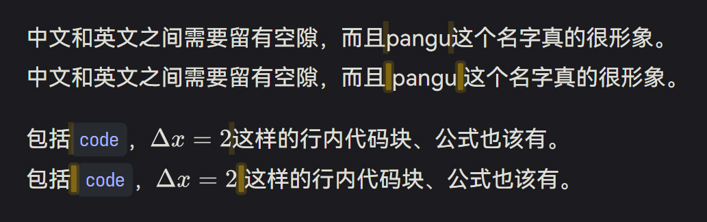
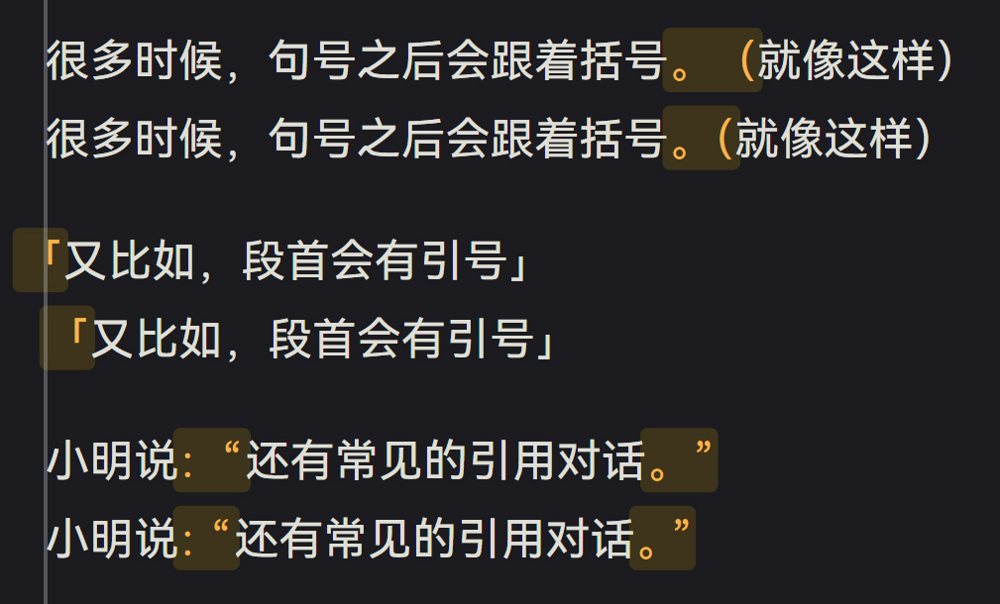

# markdown-it-autospace

  


一款可配置的 Markdown-it 插件，用于优化中文排版。

由于 [pangu.js](https://github.com/vinta/pangu.js/) 没有对 Markdown 的支持，[markdown-it-pangu](https://github.com/Shigma/markdown-it-pangu) 仍依赖过时项目 VuePress，且能实现标点挤压的项目 [赫蹏](https://github.com/sivan/heti) 只能在前端运行，故博采众长，编写此插件。

功能：

- 在汉字与英文之间添加空格（pangu）；
- 自定义需要添加空格的行内块；
- 标点挤压（调整标点符号之间的间距，**需要添加 CSS**）。

## 效果图





你可以在使用本项目的 [LinhoNotes](https://notes.linho.cc/) 网站看到更多实例。

## 使用

```shell
npm install -D markdown-it-autospace
```

然后在代码中：

```js
import mdAutoSpacing from "markdown-it-autospace";
// ...
md.use(mdAutoSpacing);
```

自带类型信息，若你使用 TypeScript，无需额外配置。

## 功能与选项

```ts
interface AutoSpacingConfig {
  pangu?: boolean;
  mojikumi?: boolean;
  spacingItems?: string[];
}
```

你可以像这样传入配置：

```js
md.use(mdAutoSpacing, {
  pangu: true,
  mojikumi: true,
  spacingItems: ["code_inline", "math_inline"],
});
```

### `pangu`

`boolean`，默认值为 `true`。

是否自动在汉字与数字、字母间添加空格。

此功能的实现基于 [pangu.js](https://github.com/vinta/pangu.js/)。

### `mojikumi`

`boolean`，默认值为 `false`。

是否执行标点挤压。

> [!warning]
>
> 此功能需要配合 CSS 实现。你应当在渲染结果所在的页面上添加如下 CSS：
>
> ```css
> punc-spacing {
>   display: inline;
> }
> .punc-half {
>   margin-inline-end: -0.5em;
> }
> .punc-quarter {
>   margin-inline-end: -0.25em;
> }
> .punc-before-less {
>   margin-inline-start: -0.4em;
> }
> .punc-before-more {
>   margin-inline-start: -0.6em;
> }
> ```

此功能的实现离不开 [赫蹏](https://github.com/sivan/heti)。

### `spacingItems`

`string[]`，默认值为 `["code_inline", "math_inline"]`。

指定需要在前后添加空格的 Markdown-it token。默认对行内代码块与行内公式启用。如不需要此功能，请传入 `[]`。

此功能的实现离不开 [markdown-it-pangu](https://github.com/Shigma/markdown-it-pangu)。
